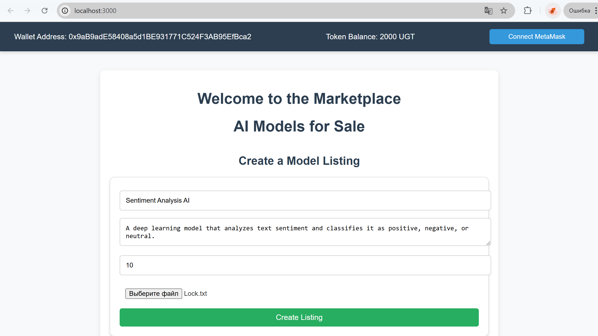
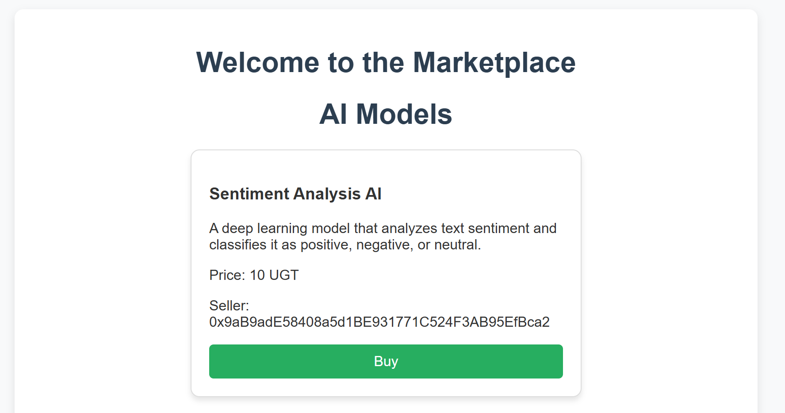

# AI Model Marketplace with UGT Token

## Overview

This project implements a decentralized marketplace where users can buy and sell AI models using a custom ERC-20 token called **UGT**. The marketplace allows model creators to monetize their AI models while enabling buyers to securely purchase them using the UGT token. This marketplace integrates an ERC-20 token smart contract, along with a marketplace smart contract for listing, purchasing, and rating AI models.

---

## Features

### 1. User Authentication and Wallet Integration
- **Wallet Connection**: Users can connect their wallets (such as Metamask) to the marketplace, allowing interaction with the blockchain.
- **Smart Contract Interaction**: Once connected, users can list, buy, and rate AI models directly from their wallet.

### 2. Token Balance Display
- **Display UGT Token Balance**: The user's UGT token balance is displayed on the marketplace interface.
- **Balance Refresh**: Users can refresh their token balance to reflect real-time transactions.

### 3. AI Model Listings
- **Model Details**:
  - Users can view a list of AI models for sale with details including:
    - Model Name
    - Description
    - Price (in UGT tokens)
- **Seller Actions**:
  - Sellers can create new AI model listings by providing:
    - Model name
    - Model description
    - Price in UGT tokens
    - Secure link to the model or upload option

### 4. Purchase Flow
- **Model Details**: Buyers can view the details of AI models before making a purchase.
- **Purchasing**: Buyers can purchase models by transferring the specified amount of UGT tokens to the seller’s address. 
- **Transaction Confirmation**: Once the purchase is successful, the marketplace UI will be updated to reflect the transaction (mark the model as sold, etc.).

### 5. Rating System
- **Post-purchase Rating**: After buying a model, users can rate the model on a scale of 1 to 5 stars.
- **Rating Storage**: Ratings are stored and updated on the marketplace contract.

---

## Smart Contracts

This project involves two primary smart contracts:

### 1. UGT Token (ERC-20)
The **UGT token** is a custom ERC-20 token used as the currency for purchasing AI models on the marketplace. The smart contract manages token transfers, balances, and allows interactions with the marketplace contract.

### 2. AI Model Marketplace Contract
The **AI Model Marketplace** contract allows users to list, purchase, and rate AI models. It also interacts with the UGT ERC-20 token contract to facilitate transactions.

Key functions:
- **listModel**: Allows sellers to list new models on the marketplace.
- **purchaseModel**: Allows buyers to purchase AI models using UGT tokens.
- **rateModel**: Allows users to rate AI models after purchasing.
- **getBasicModelDetails**: Retrieves basic details about a model.
- **getAdditionalModelDetails**: Retrieves additional details such as ratings and transaction status.

---

## Usage

### 1. **Setting Up the Environment**
To interact with this marketplace, you need:
- A **Web3-enabled wallet** (e.g., Metamask).
- **Solidity development environment** (e.g., Remix, Hardhat, or Truffle) to deploy the contracts.
- A **local Ethereum network** (e.g., Ganache) or a public network (e.g., Rinkeby, Mainnet) to deploy the contracts.

### 2. **Deploying the Contracts**
1. Deploy the **UGT Token Contract** (ERC-20) to the blockchain.
2. Deploy the **AI Model Marketplace Contract** and provide the address of the deployed UGT token contract to the constructor.

### 3. **Interacting with the Marketplace**
1. **Connect Your Wallet**: Use Metamask or any other Web3 wallet to connect to the marketplace.
2. **View Token Balance**: Check your UGT token balance to ensure you have enough tokens to make a purchase.
3. **Listing a Model**: Sellers can list their AI models by providing:
   - Model name
   - Model description
   - Price in UGT tokens
4. **Purchasing a Model**: Buyers can browse the marketplace, select a model, and purchase it using UGT tokens.
5. **Rate Models**: After purchasing, users can rate the models on a scale of 1 to 5.

---

## Example Usage Flow

1. **Seller Lists a Model**:
   - The seller lists an AI model called "AI Art Generator" with a description and a price of 50 UGT tokens.

   
   
   
2. **Buyer Purchases a Model**:
   - The buyer purchases the "AI Art Generator" by sending 50 UGT tokens to the seller's wallet.

3. **Buyer Rates the Model**:
   - After the purchase, the buyer rates the model 4 out of 5 stars, and the rating is stored on the marketplace contract.

---

## Security Considerations

- **ERC-20 Token**: The marketplace interacts with the custom ERC-20 UGT token, which is used for transactions.
- **Smart Contract Security**: All transactions are secure, using the standard `transferFrom` method to facilitate token transfers between users and sellers.
- **User Verification**: Only verified users who have purchased a model can rate it, preventing fraudulent ratings.

---

## License

This project is licensed under the MIT License. See the LICENSE file for more details.

---

## Contributing

We welcome contributions to improve the marketplace. You can contribute by submitting bug fixes, features, or improvements via pull requests.
